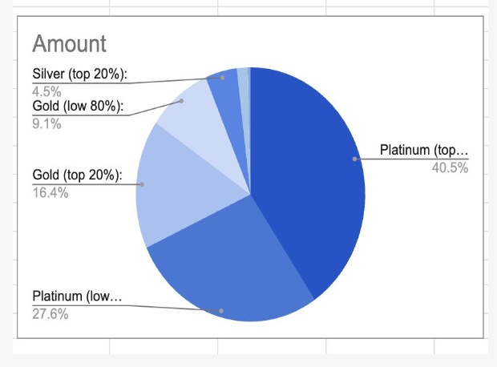
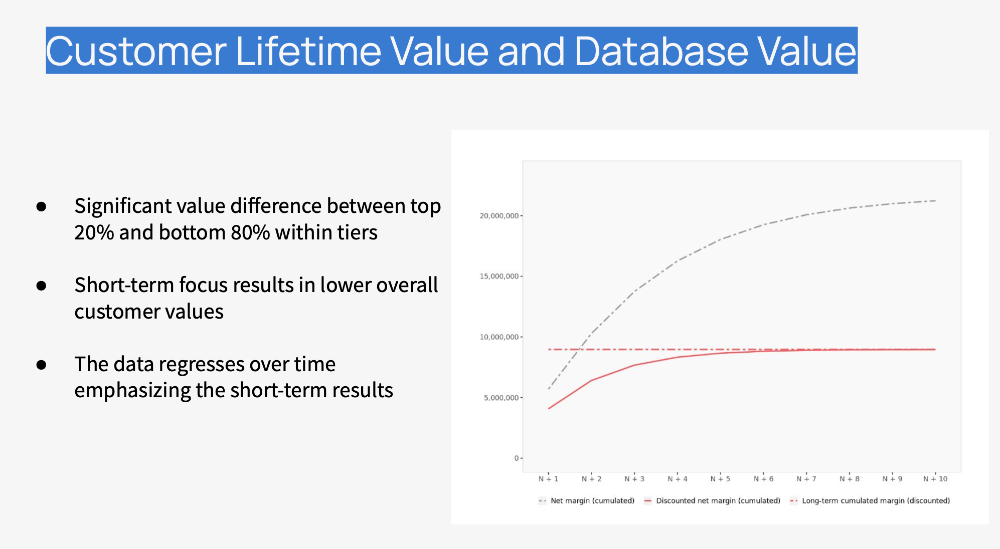

# ✈️ Northern Aero Loyalty Program Optimization – Advanced Marketing Analytics Case Study

**Author:** Mahima Advilkar  
**Role:** Marketing Analytics Consultant  
**Domain:** Airline Loyalty Strategy | Customer Lifetime Value (CLV) | ROI Optimization  
**Tools & Techniques:** Excel, Tableau, CLV Modeling, Segmentation, Transition Matrix Analysis

---

## 📌 Executive Summary

This project is a comprehensive marketing analytics case study on **Northern Aero**, a Scandinavian airline looking to reassess and improve the ROI of its Frequent Flyer Loyalty Program. By applying **Customer Lifetime Value (CLV)** models and **transition matrix simulations**, the project identifies key value segments, quantifies long-term program returns, and develops a **data-driven investment strategy** to improve retention and reduce inefficiencies in loyalty spending.

It combines advanced quantitative modeling with marketing strategy to answer one fundamental question:  
**“Is Northern Aero’s loyalty program worth the investment—and if so, how can it be optimized?”**

---

## 🎯 Project Goals

- Evaluate total **economic value** of customer segments using CLV
- Simulate program value under **15% and 40% discount rates**
- Quantify incremental value contributed by the loyalty program
- Design a **targeted spend strategy** using segment-based ROI modeling
- Recommend actionable steps for maximizing long-term customer retention

---

## 📊 Data Structure & Segmentation

- **Total Customers**: 58,000 Frequent Flyer members

- **Segments**: Platinum, Gold, Silver, Inactive, Lost
- **Sub-segments**: Top 20% and Bottom 80% of customers (by revenue contribution)

### Key Variables Used:
| Feature                  | Description |
|--------------------------|-------------|
| Transition Probabilities | Likelihood of movement between segments |
| Yield                    | Passenger revenue per mile |
| Loyalty Cost             | Program cost per customer per year |
| Margin                   | Gross margin per customer |
| Discount Rate            | Applied to future earnings (15% and 40%) |

---

## 🧮 Analytical Approach and ## 📈 Key Visuals

### 1. **CLV Calculation**

CLV was computed across all segments using two approaches:
- **15% Discount Rate** (Industry Standard)
- **40% Discount Rate** (Short-Term Tactical View)

📌 Top-performing segments like **Platinum Top 20%** had a CLV > \$3,400  
📉 Lower-value customers (Silver 80%, Inactive) had CLVs < \$200

---
### 2. - Question 2: Loyalty Program Analysis 40% Discount Rate (Short-Term Tactical View)

### 3. - Question 3: What is the return on investment of the loyalty program?

To assess true impact, we simulated:
- CLV under current program investment

  
  
- CLV assuming **no loyalty program costs**

 
  

### **Scenario Simulation – With vs. Without Loyalty Program**

 

  

**Results**:
- Total program value (with loyalty): **\$14.2 million**
- Value without program: **\$8.5 million**
- Net gain: **\$5.7 million**  
✅ The loyalty program drives a **67% uplift** in customer lifetime value

---

### 4. - Question 3 **ZENITH Optimization Strategy**

To reduce waste and boost ROI, we proposed:
- ✅ **Double down on Top 20% in Platinum and Gold**
- ✅ **Minimal spend on Silver Top 20%**
- ❌ **No investment in Lost and Inactive**
- ✅ Reallocate to high-yield segments while keeping budget nearly flat  
  *(Old: \$661K → New: \$703K)*

---

## 💡 Strategic Recommendations

| Category             | Recommendation |
|----------------------|----------------|
| 🎯 Budget Allocation | Invest selectively in Top 20% of value segments |
| 🧪 A/B Testing       | Pilot strategy in one region to validate uplift |
| 🧠 Behavioral Triggers | Analyze inactivity patterns to prevent drop-offs |
| 📊 Tracking KPIs     | Monitor segment migration and ROI quarterly |
| 🧭 Experience Design | Reward upward mobility between tiers |

---

## 💼 Business Impact

- Improved loyalty program ROI through **targeted reinvestment**
- Avoided overspending on low-CLV segments without return
- Empowered stakeholder teams with **data-driven strategy**
- Offered a scalable model for **airline and hospitality** use cases

---

## 🛠 Folder Structure

